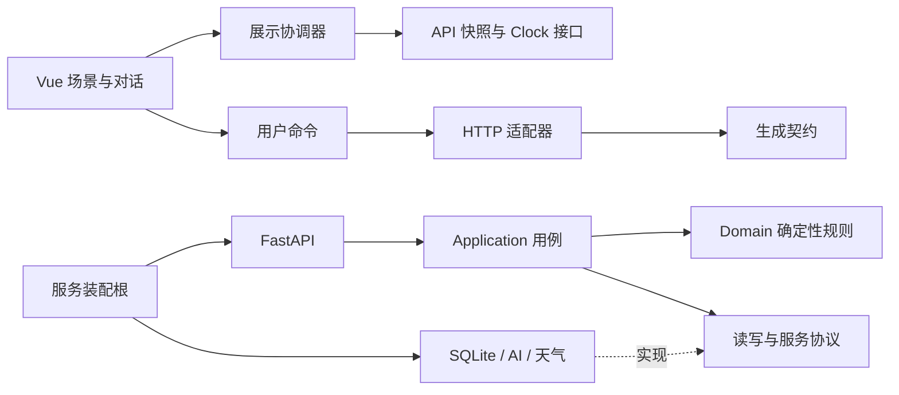

# Kairos 新项目架构提案

状态：2026-09-26 规划基线；新 Vue/Vite 与 FastAPI 应用及契约已经建立，业务实现仍在推进。用户已决定前端全新开发、旧前端仅参考，后端可审查后选择性复用。本文其余未标为已实现的内容仍是设计建议。

## 入口与事实来源

- [产品记忆](docs/memory/PRODUCT_MEMORY.md)：用户已确认意图；不在技术文档重新定义产品规则。
- [新前端设计](docs/design/FRONTEND_SPEC.md)：布局、场景、材质、动效和交互。
- [状态协调](docs/design/STATE_MODEL.md)：提醒、事件、对话、真实时间的协作。
- [后端复用与契约](docs/design/BACKEND_REUSE.md)：迁入准则、业务所有权及 API 草案。
- [Harness](docs/engineering/HARNESS.md)：K01–K16 验收、质量门禁与证据。
- [开发分工与顺序](docs/exec-plans/active/2026-09-26-rebuild.md)：依赖、代理职责及任务交接。

历史材料：两个 `XiAnHacker-*-v1` 目录与 [研读记录](docs/memory/CODEBASE_REVIEW.md)。历史记录中的“后续建议”已经被本轮新建项目决定替代。

## 三种路线的取舍

| 路线 | 收益 | 代价 | 结论 |
| --- | --- | --- | --- |
| 新前端＋合格后端模块迁入新服务 | 保留已验证的时间与事务经验，隔离旧UI与旧产品假设 | 需要来源审计、新契约及迁入回归 | 推荐 |
| 前后端完全重写 | 最清晰的来源边界 | 重写重复实例、DST、原子提交，投入更大且可能退化 | 当复用准入失败时局部采用 |
| 全新前端直接连接旧后端运行 | 初期联调较快 | 旧接口和业务缺口继续成为正式运行依赖 | 不采用，符合用户禁止直接使用半成品的要求 |

沿用 Vue/Python 技术栈不等于沿用旧项目。应用入口、前端源码、配置、依赖与运行环境重新建立；后端只迁入通过准入的代码单元。

## 拟建目录

以下为目标结构；`apps/web`、`services/api` 与 `contracts` 已建立，其余业务目录按工作包逐步实现。

```text
apps/web/
  src/app/                    新 AppShell、启动配置与组合根
  src/scene/                  环境计算、山水图层、天气渲染
  src/presentation/           提醒、当前事件、冲突与查时
  src/assistant/              会话、草稿确认、按需查询卡片
  src/platform/               时钟、输入、可访问性、恢复
  src/api/                    生成类型的使用、HTTP边界转换
  src/ui/                     小型基础控件、字体材质动效token
  tests/                      单元与组件验证
services/api/
  src/kairos/domain/          事件、实例、任务与状态规则
  src/kairos/application/     用例、草稿、对话行动编排
  src/kairos/adapters/        SQLite、模型、天气与Clock
  src/kairos/api/             HTTP schema与路由
  migrations/                新服务自己的版本迁移
  tests/                     固定时钟、临时数据库、假服务
contracts/                   生成的OpenAPI与传输类型产物
tests/e2e/                   新前后端真实HTTP用户旅程
tests/fixtures/              有版本的合成场景与AI评估样例
scripts/                     运行、契约生成与check入口
docs/evidence/               检查记录；不存敏感原始对话
```

旧目录不重命名、不整体复制、不在其内部继续开发。应用不读取旧 `.env`、`.data`、`.venv`、`node_modules`、旧数据库或浏览器旧 storage key。若以后需要迁移真实数据，另立可预览、可回滚的数据迁移任务。

## 技术与渲染建议

- Vue 3 + TypeScript + Vite：延续现有团队可读性，组件全新编写。执行阶段锁定经过验证的依赖版本，不把旧依赖目录搬过来。
- 最新用户要求采用 Three.js 建立同一山谷湖泊场景的真实纵深；先在独立预览入口完成基础空间并进行用户视觉验收，再分阶段实现昼夜、反射、天气、四季和过渡。现有业务首页仍使用 SVG/Canvas，在新场景验收前保留。详见 [第一阶段计划](docs/exec-plans/active/2026-09-26-three-valley-s1.md)。
- 几何太阳位置、天空亮度、天气遮蔽和事件视觉分别计算，合成时保留各自因果。天气不得移动太阳，事件提醒不得改变天文时间。
- Python + FastAPI + Pydantic + SQLite：新建服务装配，迁入纯领域逻辑与经过回归的事务机制。不要继续围绕旧的只读助手修补新产品。
- 单机单用户是首轮工程范围建议，并非用户已确认的部署要求；第一阶段不加入账号、云同步或后台系统通知。
- 天文计算、天气服务及可打断动效库在对应任务先做有时限的验证并记录 ADR，再锁版本。选择失败不得阻塞已有独立能力，也不得把合成数据伪装成真实服务。

## 依赖方向



约束：domain 不依赖网络、框架或环境变量；application 不导入具体适配器；前端组件不直接 fetch，不解析自然语言，不展开重复系列，不创造正式事件事实。测试夹具不能成为生产入口的依赖。旧目录不能成为任何新运行模块的 import、软链接、构建输入或PYTHONPATH。

## 四个必须分开的维度

1. **环境状态**：太阳、天气、季节、材质。持续运行，独立于日程和聊天。
2. **业务事实**：正式事件、实例、例外、提醒确认、用户冲突选择、柔性任务、草稿。由服务端维护。
3. **展示状态**：自由、提前提醒、当前事件、冲突选择，以及信息展开程度。不能反过来改写业务发生时间。
4. **交互状态**：AI 是否打开、输入、请求、未确认草稿、焦点、长按查时。业务到点不能清空它。

拒绝单个 `mode = free | ai | active` 把这些维度互相覆盖。查时是独立覆盖层；对话打开可以暂缓事件呈现，但不暂停真实日程。

## 三类时钟

| 接口 | 责任 | 生产来源 | 测试隔离 |
| --- | --- | --- | --- |
| RealClock | 长按当前真实时间 | 每次读取设备真实系统时间 | 独立端口，不被scene/schedule夹具修改 |
| SceneClock | 连续环境状态 | 真实时刻，使用确认位置/时区 | 专用场景预览注入，可加速 |
| ScheduleClock | 日程边界与本地显示估计 | 服务端时间校准，恢复时重新同步 | 固定服务端测试时钟 |

浏览器 `performance.now()` 只计算手势/动画/三秒显示时长，不能当作日历时间。不可在浏览器全局冻结 Date 来“证明”真实查时仍正确；需要独立时钟fixture。

## 数据与契约

Pydantic 是传输 schema 唯一人工来源；导出 OpenAPI 后生成 TypeScript，前端 view model 可独立但需显式映射，不丢失实例状态与版本。完整端点在后端设计文档，不在本文件维护第二份列表。

所有写入只在成功响应后显示完成；超时处于结果待确认，重试复用幂等键。刚性创建的草稿确认与提醒“知道了”是不同命令，不能共用一个 acknowledged 字段。

柔性任务与主场景快照分开。用户未询问时，环境加载、日程同步或打开空白AI面板都不得预读柔性清单或生成建议。

地理位置由用户选择城市或授权定位，不根据语言推断。没有位置仍可使用真实本地时间作基础日内环境，不能称为当地准确日出日落；天气不可用时是未知状态，不默认宣称晴天。选择位置入口置于轻量偏好层，不是安排管理页面。

## 可观测性与交付边界

开发环境可查看 scene frame、snapshot revision、状态变化原因、请求ID和时钟偏差；这些属于开发工具，不能放进面向用户的主场景。默认不记录原始聊天、精确位置或模型密钥。

每次交付附验收场景、运行命令、退出结果和必要截图/trace。无真天气连接、无真实AI评估、只有fixture运行时，必须分别标明，不能以构建成功宣布完整产品完成。
