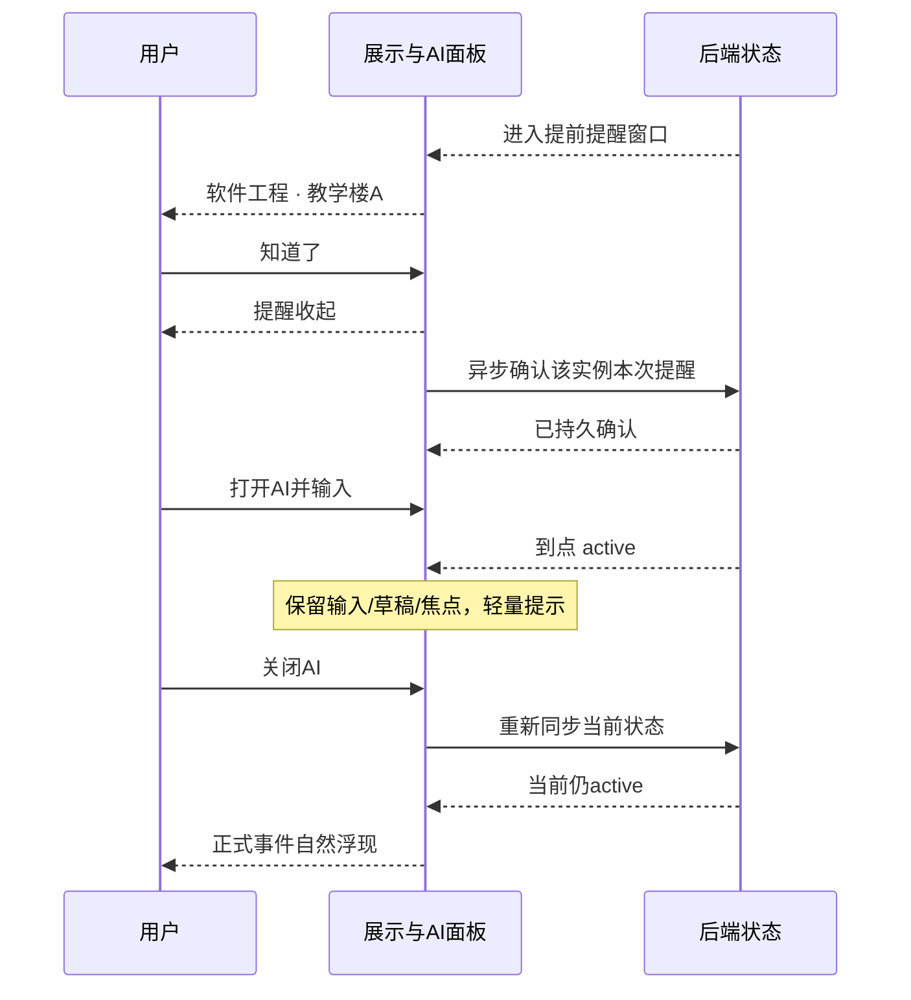

# 状态协调设计

状态：规划提案。已确认产品规则见 [产品记忆](../PRODUCT_MEMORY.md)；具体交互提案见 [前端设计](FRONTEND_SPEC.md)。本文件以数据流解释规则，不宣称已实现。

## 状态所有权

| 数据 | 所有者 | 持久化原则 |
| --- | --- | --- |
| 事件时间、重复规则、实例例外 | 后端事件领域 | 正式数据库，实例与系列分开 |
| 提前提醒确认 | 后端实例交互记录 | 实例身份＋安排版本，刷新可恢复 |
| 当前冲突选择／其他错过 | 后端显式用户命令 | 原子写入所选实例与本次冲突集合 |
| 草稿及其revision／提交结果 | 后端草稿用例 | 与正式事件分开，确认后原子提交 |
| 柔性任务及deadline | 后端任务用例 | 不进入场景日程快照 |
| AI输入与焦点、面板位置 | 前端会话store | 到点/同步不改写；本地恢复策略由会话模块实现 |
| 当前事件信息是否展开 | 前端展示store | 不等于出席或取消 |
| 长按时间覆盖层 | 前端独立查时模块 | 短暂，不改业务和对话状态 |

重复实例的稳定身份与改期版本依据后端契约设计。一次提醒确认不能被当作整个系列确认。

## 首轮建议值，尚非用户决定

| 决策 | 建议 | 改动影响 |
| --- | --- | --- |
| 提前提醒窗口 | 默认开始前5分钟，一次提醒窗口 | 参数化，验收fixture不依赖硬编码 |
| 点击提前“知道了” | 立即关闭本地提示，异步保存；当前实例当前安排版本内不再提醒 | 刷新恢复本地待同步或后端ack；明确改期后可以生成新提醒 |
| 正式事件“知道了” | 收起标题/地点/按钮，保留轻量事件入口与专注环境 | 点击入口恢复信息，不改变事件状态 |
| 正式事件“例外” | 首轮提供这次请假、取消本次；系列变更在AI中明确范围 | 单次操作不能级联后续 |
| 未处理冲突 | 显示并等待选择，环境继续流动 | 不按排序默认选第一个 |
| 同时临近的提醒 | 在同一提醒层显示多个事件，可分别确认 | 不静默省略，也不提前作冲突出席决定 |
| 对话期间事件结束 | 关闭AI后同步当前事实，不补播已结束事件 | 避免过时场景队列 |

上表是形成可实现设计所需的建议值，后续确认或更改应写入决策记录，不能偷偷升级为既定需求。

## 展示推导的输入输出草案

```ts
type PresentationState = {
  base: 'free' | 'active' | 'conflict'
  visibleOccurrenceIds: string[]
  prestartOccurrenceIds: string[]
  eventDetail: 'expanded' | 'collapsed'
  assistantOpen: boolean
  pendingSceneRefresh: boolean
  timePeekVisible: boolean
}
```

字段是前端展示结构建议，正式传输结构以生成契约为准。`base` 不含天气或AI模式，`prestartOccurrenceIds` 不是持久“下一事件列表”，只包含当前有效提醒窗口内的实例。已明确选择其他事件而被标为missed的实例不得再次成为候选。

快照提供当前业务事实，展示协调器根据交互状态决定何时呈现。若 API 信息不完整或过期，保留已知状态并标记同步失败，不把错误等价成 FREE。

## 转移表

| 输入 | 业务结果 | 主场景 | AI输入与草稿 |
| --- | --- | --- | --- |
| 进入有效提前窗口 | 不改变事件发生状态 | 提示名称、地点、知道了 | 原样保留 |
| 点击提前知道了 | 本地登记待同步ack并发请求 | 立即撤下本次提醒及增强效果 | 原样保留 |
| 提前知道了成功 | 服务端写入实例提醒确认，清理本地待同步项 | 保持已关闭 | 原样保留 |
| 未确认且更临近 | 仍是未确认提醒 | 局部对比/边缘光渐增，有上限，无闪烁倒计时 | 原样保留 |
| 提醒确认请求失败 | 未被服务端确认，本地关闭不等于持久成功 | 保持关闭，不重新催促；轻量同步失败与重试 | 原样保留 |
| 开始边界，AI关闭 | 依实际时刻进入active | 自然浮现，无需开始按钮 | 原样保留 |
| 开始边界，AI打开 | 依实际时刻进入active | 不替换前台对话；面板内轻量提示 | 原样保留，焦点不移动 |
| AI关闭 | 不改变发生时刻 | 重新同步；展示此刻仍有效的事件或冲突 | 草稿继续保留 |
| 正式知道了 | 不写已出席，不取消 | 收起信息，仅改变展开程度 | 原样保留 |
| 这次请假成功 | 当前实例excused | 若无其他有效事件则回FREE | 相关查询刷新，未发送输入不变 |
| 多个active，无决定 | 不自动修改任何实例 | 冲突选择，名称＋地点无数字时间 | 若AI打开仍仅轻量提示 |
| 用户选择A | A作为主显示；当前冲突集合中其余实例missed | A事件场景 | 原样保留 |
| 新实例C到点与A冲突 | 不沿用对旧集合的选择 | 展示新的待选择冲突 | 不打断AI |
| 所选A结束，其余已missed | 不自动恢复错过实例 | FREE，除非存在新的有效事件 | 原样保留 |
| 结束边界 | 该实例不再active | 内容淡出，环境连续 | 原样保留 |
| 长按空白成立 | 无业务操作 | 真实时钟临时覆盖约3秒 | 原样保留 |
| 午夜 | 正常时间推进 | 无重置、无总结 | 原样保留 |
```

选冲突请求必须携带有效集合版本；提交时集合变化则返回需要重新选择，不能把用户未见过的事件标为错过。missed表示用户本次选择的结果，不是系统验证了实际缺席。

## 时序示例



## 断网、恢复与时间

- 请求序号和快照版本共同防止旧响应覆盖新状态；mutation完成后只接受满足对应版本的快照。
- 后台恢复先重算真实时间并同步，不逐条补播过期提醒；仍在窗口才显示有效未确认提醒。
- 缓存必须保留状态、例外、实例身份、版本及有效期。不能只按起止时间把所有缓存实例变成active。
- 离线不能确认新的冲突结果或伪装成功写入。可显示已知信息，但修改保留为未提交请求；不自动跨新冲突集合重放。
- 提前提醒关闭是上述写入规则中的呈现例外：本地立即关闭并保存pending ack，不声称服务端成功；恢复时先查实例安排版本，只重试同一有效提醒，不让过期ack确认改期后的新提醒。
- 设备调时、时区更改时重新校准；对话相对日期以草稿首次解析时刻为准，不能因午夜追问变成另一日。
- 查询当前真实时间走RealClock；场景Demo加速仅走SceneClock，业务fixture仅走隔离ScheduleClock。

## 需由验收直接覆盖的反例

提前知道了不得打开AI或使课程提前active；长按不得创建任务；查询柔性任务不得新建任务；保存草稿不得自动确认；关闭AI不得恢复已结束事件；请假不得隐藏整系列；冲突选择不得漏掉同集合中的其他missed记录；API失败不得切换成演示成功数据。
