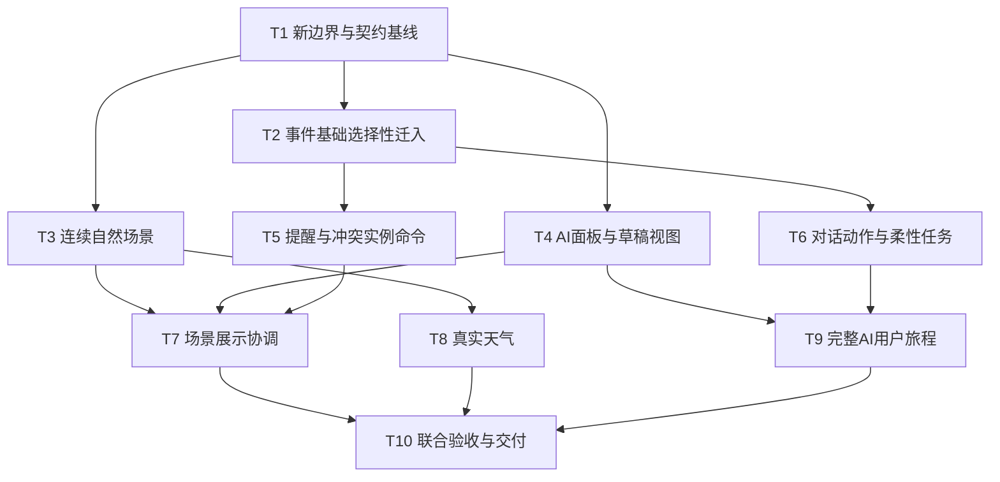

# Kairos 新项目开发规划与子代理任务书

> 执行方法：用户已要求子代理分工。实施使用 `superpowers:subagent-driven-development` 的实施与独立审查流程；跨模块写入按本文所有权和依赖顺序执行，不让代理同时修改共享入口。当前实施已启动；逐项状态以“当前进度与决策”及任务报告为准。

**Goal:** 全新建立符合产品约束的自然专注前端，迁入经审查的后端基础，完成事件、柔性任务、AI、天气与状态同步。

**Architecture:** 新 `apps/web` 与新 `services/api`，两个旧目录仅供阅读。服务端维护正式业务事实，前端分离环境、展示和会话；生成契约连接两端。

**Tech Stack:** 建议 Vue 3 / TypeScript / Vite、SVG + Canvas 2D、Python / FastAPI / Pydantic / SQLite。版本及新增依赖在T1和各依赖验证任务锁定，不复制旧环境。

**Spec:** [总架构](../../../ARCHITECTURE.md)、[前端设计](../../design/FRONTEND_SPEC.md)、[状态模型](../../design/STATE_MODEL.md)、[后端复用](../../design/BACKEND_REUSE.md)、[Harness与需求ID](../../engineering/HARNESS.md)。

## 全局约束

- 用户确认：自然山水，光照更真实；全新前端，旧项目不直接运行作新产品。
- 只允许审核通过的后端代码选择性迁入；禁止旧目录runtime import、代理旧服务充作新后端、复制密钥／数据库／虚拟环境／node_modules。
- 用户当前要求优先于旧文档；旧AGENTS不随复用代码迁入。
- 主场景隐藏数字时间、进度、任务清单、下一事件；刚性提醒窗口内例外展示名称和地点。
- 柔性任务不主动查询或推荐；刚性事件只有草稿确认后保存；用户的冲突决定才能写missed。
- 到点不关闭AI、不清空输入、不移动焦点；长按始终读取真实时间。
- 所有任务将计划状态、实现状态和验证状态分开记录，不能以文档或fixture代替完成证据。

## Review Focus

1. 加速场景、系统调时、跨午夜与设备恢复时查时仍真实，草稿日期不漂移。归T3/T7/T9。
2. 已请假、取消或missed的实例不能因离线缓存、旧响应、下一次轮询重新出现。归T2/T5/T7。
3. 用户确认提醒后刷新不复现；确认冲突时新事件到点不能被默默标为错过。归T5/T7。
4. 模型返回多个候选、缺字段或伪造动作时不能截断、补猜或越过确认写入。归T4/T6/T9。
5. 天气失败、地理位置拒绝、减少动态效果或文字放大时，场景可用且状态仍可理解。归T3/T8/T10。

## 本轮规划分工与实际交接

| 本轮代理 | 独立任务 | 唯一写入文件 | 主协调职责 |
| --- | --- | --- | --- |
| frontend_design | apple-design、新前端布局与自然场景规范 | `docs/design/FRONTEND_SPEC.md` | 与产品记忆和状态模型对齐 |
| backend_reuse | 旧后端逐模块审计、新契约建议 | `docs/design/BACKEND_REUSE.md` | 审核是否偷偷沿用旧产品限制 |
| harness_quality | 可执行门禁规划、K01–K16与证据体系 | `docs/engineering/HARNESS.md` | 检查命令是否标明尚未实现 |
| 主协调 | 决策、架构、状态、任务DAG、入口和整合 | 其余本轮规划文件 | 处理冲突，验证文档与来源 |

实际结果：前端代理完成并交付；后端与Harness代理已落文，但在最终校核阶段遇到额度限制。主协调接手后两份文件核对、修正并整合；不能将其记为两名代理已完成独立终审。

## 实施角色与文件所有权

角色是任务职责，不要求保持同一代理上下文，也不表示同时启动所有角色。并发上限为主协调＋3个子代理。

| 角色 | 可写路径（拟建） | 不得自行改动 |
| --- | --- | --- |
| C 协调／契约 | 根脚本、锁文件、共享配置、生成契约、API组合入口、任务账本 | 不以整合名义重写代理未审查变更 |
| B 事件与存储 | `services/api/src/kairos/{domain,application,adapters}` 中事件/实例/存储模块及对应测试、migration | 前端、天气模块、公共HTTP schema |
| S 自然场景 | `apps/web/src/scene`、场景专用tests、原创图形 | API、会话、提醒业务规则 |
| U 交互与会话 | `apps/web/src/{assistant,presentation,ui,platform}` 及对应测试 | 场景内部、服务端领域、生成类型 |
| A 助手与柔性任务 | 后端assistant/tasks模块、模型adapter及测试 | 已锁事件规则、共享migration序号自行分配 |
| W 天气接入 | 后端weather端口/adapter、前端weather映射与测试 | 太阳时间函数、事件状态、模型保存权限 |
| Q 独立质量 | `tests/e2e`、测试fixtures、证据、审查报告 | 未经任务转交不修实现者源码 |

同一波次只派互不重叠的写入范围。B/A若需同时修改SQLite或migration，改为先后执行；C分配migration编号。共享API schema变更先由提出者给出差异，C合入并重新生成，消费者随后更新。

## 依赖与波次



- 波次0：C完成T1，发布带版本的接口和fixture。没有合同基线不得让两端各猜字段。
- 波次1：B执行T2、S执行T3、U执行T4，三路独立。
- 波次2：B依次T5→T6（可转交A），U在T5通过后T7，W在T3后T8。若服务端组合文件冲突，由C串行整合。
- 波次3：U执行T9；Q准备及执行T10，C处理接入。Q只有已审查的联合版本才给最终结果。
- 每项结束先独立审查再供下游使用；同一实现者不能充当自己任务的唯一审查者。

## 通用任务协议

每份派单包含：目标、需求ID、已定契约版本、允许写入路径、不得触碰路径、输入输出、可复现验收、依赖完成证据和退出条件。代理只返回当前任务结果，不自行增加产品范围。

业务任务循环：先写下面指定情景的失败用例 → 观察行为相关失败 → 实现最小闭环 → 运行相应检查 → 记录证据 → 独立审查。基础配置/文档不写镜像测试。新问题先归因，不能删除测试或换成Demo掩盖失败。

当前统一检查入口为 `python3 scripts/check.py <scope>`。T1已建立文档、隔离、契约、API和Web门禁；`e2e` 明确未实现，直到T10提供浏览器旅程前不得声称其通过。

## Task 1: T1 新运行边界和契约基线

**Owner:** C；**需求:** K01/K15；**依赖:** 本轮规划评审。

**Files:** 创建 `apps/web/package.json`、`services/api/pyproject.toml`、`services/api/src/kairos/api/schemas.py`、`contracts/openapi.json`、`contracts/backend-api.d.ts`、`scripts/check.py`、`scripts/dev.py`、`tests/fixtures/scenarios.json`；配置新锁文件、gitignore和CI。旧文件只读。

**Interfaces:** 后端设计中的endpoint/schema成为人工schema来源；生成契约版本提交后供T2–T9消费。共享 `Scenario` fixture包含合成用户、位置、事件、时钟与天气状态，不包含凭据。

- [ ] 新建独立依赖与服务装配；启动只读健康接口和空自然容器，不依赖旧路径。
- [ ] 根据后端设计将草稿、实例状态、提醒、冲突、任务、会话和天气传输结构录入Pydantic并生成契约；未知产品决策标在决策记录中，不靠schema默认值偷偷决定。
- [ ] 实现隔离检查、导入方向检查、生成diff检查、文档链接检查与明确skip规则；放入违反边界的合成fixture，检查必须失败。
- [ ] 用新临时数据库启动两端，并验证HTTP未接通时显示真实错误，不回退旧Demo。
- [ ] 执行 `python3 scripts/check.py docs`、`architecture`、`contracts`；记录契约hash、命令与结果。

**Exit:** 两端可独立从新目录运行；生成两次契约无差异；所有旧目录运行依赖为零。T1不要求已有业务能力。

## Task 2: T2 事件与草稿基础选择性迁入

**Owner:** B；**需求:** K08/K12/K15；**依赖:** T1。

**Files:** 新 `services/api/src/kairos/domain/{events,state,time_rules,recurrence,conflicts,occurrence_identity,drafts}.py`、`application/{drafts,draft_commit,event_commands,occurrence_commands,state,ports}.py`、`adapters/persistence/*`、`adapters/clock.py`、`services/api/migrations/001_initial.sql`；测试 `services/api/tests/{unit/test_time_rules,integration/test_drafts,integration/test_exceptions}.py`；维护 `docs/engineering/REUSE_LEDGER.md`。这些target与后端复用矩阵一致。

**Interfaces:** 消费T1草稿/实例schema；输出后端设计中的草稿确认、事件读取、单次例外、state端点。Stable occurrence identity不因UI标题或显示排序改变。

- [ ] 用独立测试锁定半开区间、跨午夜、DST、系列单次例外、草稿未确认零写入、版本及幂等；选择性迁入前观察缺失能力失败。
- [ ] 按复用矩阵逐文件登记源路径、hash、原测试、修改原因与新测试；只迁入准入模块。
- [ ] 新应用处理多候选原子提交与冲突复检；没有候选丢失、猜时或静默180天重复范围。
- [ ] 迁入回归与新契约测试通过后由独立审查确认没有复制旧范围限制。
- [ ] 执行 `python3 scripts/check.py api`、`contracts`、`architecture`。

```gherkin
Given 每周一课程系列与本周实例A
When 用户对A请假并重新加载
Then A为excused，下一周实例仍scheduled，系列仍存在
Given 一个含3个候选的ready草稿
When 提交时第2个事件写入失败
Then 0个正式事件保存，草稿仍可重试，重试成功只产生3个事件
```

## Task 3: T3 连续自然场景与独立时钟

**Owner:** S；**需求:** K02/K03/K04/K05/K16；**依赖:** T1。

**Files:** 新 `apps/web/src/scene/{environment,solar,palette,renderer}.ts`、`NatureScene.vue`、`layers/*`、`apps/web/src/platform/clocks.ts`（C协助锁接口）；测试 `apps/web/tests/scene/{environment,clock-isolation}.test.ts`。

**Interfaces:** `computeEnvironment({instant,location,weather,season}): EnvironmentFrame` 为纯计算建议；Frame含天体位置、天空颜色、光强、能见度、降水参数。天气输入为T1契约的规范化只读值；RealClock和SceneClock不能共享可加速变量。

- [x] 采用无新增依赖的近似太阳计算，未授权位置时按本地钟表降级；算法标注 approximation，不宣称天文精度。
- [x] 建立同一真实时刻晴/雨只影响遮蔽不影响太阳位置，以及跨午夜颜色连续性测试。
- [x] 原创建立湖岸场景，覆盖晨光、日间、夕照、夜空连续插值；水光与粒子独立于事件态。
- [x] 场景fixture支持规范化天气外观与Reduced Motion；fixture不代表真实天气接通。
- [ ] 执行 `python3 scripts/check.py web` 已通过；桌面/手机四时段截图、逐帧性能、真实位置与天气接入、长按查时仍待完成。

**Exit:** 默认无主标题、安排CTA、钟表或任务清单；太阳随时间推进，天气不改天体位置；减少动态效果仍看得懂环境状态。

## Task 4: T4 按需AI面板与完整草稿视图

**Owner:** U；**需求:** K12/K13/K15/K16；**依赖:** T1。

**Files:** 新 `apps/web/src/assistant/{AssistantPanel,Conversation,Composer,DraftReview}.vue`、`sessionStore.ts`、`apps/web/src/ui/{Surface,ActionButton}.vue`、`motion.ts`；测试 `apps/web/tests/assistant/{session,draft-review}.test.ts`。

**Interfaces:** 消费会话和DraftResponse生成类型；提交输出为显式确认命令，不由模型文字触发。面板开闭通知展示协调器，输入store独立于挂载/卸载。

- [x] 测试3候选全部可见且提交未丢失、缺字段保持追问、未确认零commit请求、关闭再开输入仍在。
- [x] 桌面右侧浮层、手机底部面板；新组件，不搬旧SchedulePanel，不设安排标签。
- [x] 支持面板反向关闭、键盘焦点回归；关闭不删除会话草稿。
- [x] 服务失败保留原文/草稿，不输出假的保存成功；命令尚未接真实API，显示诚实的离线提示。
- [ ] `python3 scripts/check.py web` 已通过；真实指针/键盘中途反向操作、独立审查、真实助手HTTP命令接线仍待完成。

## Task 5: T5 提前提醒与冲突选择的实例命令

**Owner:** B；**需求:** K06/K07/K09/K14；**依赖:** T2。

**Files:** 新后端 `domain/attention.py`、`application/attention.py`、`adapters/persistence/attention_store.py`、独立migration；测试 `services/api/tests/integration/{test_reminders,test_conflict_choice,test_state_versions}.py`。路由装配由C完成。

**Interfaces:** 按后端设计提供提醒确认、冲突决策及包含版本的state；没有用户命令不得产生missed。

- [x] 为提醒窗口、ack后刷新、改期旧ack失效、开始前不active建立固定Clock集成测试。
- [x] 提醒确认持久化，使用发生版本和排期修订号校验；错误响应不得代表成功确认。
- [ ] 冲突命令以当前集合版本校验，在同一事务内选A并记其余missed；集合变化拒绝旧决策。
- [ ] 重复请求幂等、后续重复实例不受影响；系统时间推进不会自动挑选。
- [ ] `python3 scripts/check.py api`、`contracts` 已通过；冲突决策、state revision与端到端同步仍待完成。

```gherkin
Given A与B当前冲突，界面持有冲突集合版本v1
When C到点后用户仍提交v1选择A
Then 请求要求重新查看，A/B/C均未因旧请求被标为missed
```

## Task 6: T6 柔性任务与可控对话动作

**Owner:** A（与B共享数据库文件时顺序执行）；**需求:** K10/K11/K12/K13；**依赖:** T2。

**Files:** 新后端 `domain/tasks.py`、`application/{conversations,tasks,action_policy}.py`、`adapters/ai/assistant_model.py`、`adapters/ai/prompts/*`、`adapters/persistence/task_store.py`、相应migration与 `services/api/tests/integration/{test_tasks,test_assistant_actions}.py`、`tests/fixtures/assistant-evals.json`。

**Interfaces:** 消费有会话ID与上下文版本的输入；输出回答、澄清或结构化操作提案。正式刚性写入只能通过草稿确认；柔性写入需来自用户明确添加意图并经过确定性验证。

- [ ] 测试“周日前完成操作系统实验”真实保存；单纯“有哪些快截止”不创建任务；场景加载和只打开AI不访问任务仓库。
- [ ] 建立deadline解析缺歧义追问、多轮会话、已有事实引用和任务查询范围策略，不能让模型凭空填任务。
- [ ] 对自然语言修改/删除/请假解析目标和实例/系列范围，歧义追问；校验后调用窄命令，不赋予模型任意SQL或HTTP执行权限。
- [ ] 使用假模型覆盖超时、幻觉任务、伪造确认、攻击性事件名称、重复请求；真实模型评估另留明确证据。
- [ ] 执行 `python3 scripts/check.py api`、`contracts`；失败不能改为只回一句“已记住”。

## Task 7: T7 主场景提醒、事件与查时协调

**Owner:** U；**需求:** K05/K06/K07/K09/K13/K14；**依赖:** T3/T4/T5。

**Files:** 新 `apps/web/src/presentation/{controller,reminders,sync}.ts`、`{ReminderLayer,ActiveEventLayer,ConflictChoice,TimePeek}.vue`；`apps/web/tests/presentation/*.test.ts`。AppShell组合修改由C整合。

**Interfaces:** 消费state生成类型、独立Clock与sessionStore；输出前端展示状态与显式用户命令，不能修改环境天文时刻。

- [ ] 按STATE_MODEL转移表建立失败用例，尤其AI打开时到点、恢复时事件已结束、API乱序、例外缓存。
- [ ] 点击知道了立即撤下提醒与增强效果，pending ack独立同步；网络失败只显示轻量同步提示、不重新催促，刷新重试先校验安排版本。未点击局部增强且强度有上限；正式事件不显示时间数字与完成率。
- [ ] 实现长按空白、移动取消和键盘等价查时；无论场景加速多少，读取RealClock，约3秒后淡出。
- [ ] 对话保留输入、草稿和焦点；关闭后重读当前事实，不播放过期事件队列。
- [ ] 执行 `python3 scripts/check.py web`、`e2e`的日程子集；验证增加新冲突时没有自动选取。

## Task 8: T8 真实天气与位置接入

**Owner:** W；**需求:** K03/K04/K16；**依赖:** T3；服务端共享装配由C处理。

**Files:** 新后端 `application/weather.py`、`adapters/weather_provider.py`；前端 `scene/weather.ts`、`platform/location.ts`、轻量偏好组件；对应后端/前端天气测试与供应商ADR。

**Interfaces:** 后端规范化WeatherResponse包括来源、位置、观测时间、鲜度与不可用状态；前端环境函数不直接依赖供应商字段。

- [ ] 先核对候选供应商的许可、调用额度、位置能力、预报范围和部署约束，记录选型后才实现真实adapter；用户凭据不进入前端。
- [ ] 测试天气过期/超时/拒绝定位，主时间仍运行；未知天气不被写为晴，天气变化不改变太阳几何位置。
- [ ] 接用户选择城市或授权定位；允许先使用基础时间场景，位置取得后平滑更新。
- [ ] 将晴、云、阴、雨、雾、雪接入相同渲染参数；季节依据日期与位置调整，不能把南北半球混用。
- [ ] 执行 `python3 scripts/check.py api`、`web`；真实查询另记录时间、来源和脱敏结果，fixture检查不能代替。

## Task 9: T9 对话闭环与真实HTTP联调

**Owner:** U，C辅助接入；**需求:** K08/K10/K11/K12/K13/K15；**依赖:** T4/T6/T7，天气问答依赖T8。

**Files:** 新 `apps/web/src/assistant/{actions,queryCards}.ts` 及卡片组件、`apps/web/src/api/client.ts`；端到端 `tests/e2e/{assistant,events,tasks}.spec.ts`。

- [ ] 从新前端通过真实HTTP完成：创建刚性草稿→追问→确认；查询→改期/取消；本次请假；柔性添加→关闭→询问→查询；天气问答。
- [ ] 卡片可以显示用户主动查询所需的精确时间和deadline；禁止将其复制为自然主场景的常驻组件。
- [ ] 验证后台事件到点时正在输入、待确认草稿、正在保存三种情况均不中断；关闭后仅显示当时有效事件。
- [ ] 使用结构化结果识别操作成功，不分析模型自然语言中的“已保存”字样作状态依据。
- [ ] 执行 `python3 scripts/check.py e2e`、`contracts`；测试进程使用独立数据与服务端假模型，真实模型另测。

## Task 10: T10 联合验收与交付

**Owner:** Q独立审查，C最终整合；**需求:** K01–K16；**依赖:** T7/T8/T9。

**Files:** 新 `tests/e2e/{core-invariants,accessibility,recovery}.spec.ts`、`docs/evidence/<revision>/`、质量账本与已完成计划索引。

- [ ] 对Harness全部需求逐项追踪到实现文件、测试和证据；缺一项不得把核心闭环记为完成。
- [ ] 桌面/手机、昼夜、六天气、降低动态/透明度、高对比与200%字号做视觉验收；动画慢速回看中断/反向，无输入锁。
- [ ] 使用新服务验证暂停后台、断网恢复、跨午夜、时区切换与响应乱序；无例外复活、无幽灵保存。
- [ ] 执行 `python3 scripts/check.py all`；记录实际子命令与退出码；未配置真实供应商必须明确列出对应未验收项。
- [ ] 输出剩余问题、复用来源、契约版本和运行手册。只在全部退出条件满足后迁移计划到completed；不自动部署或清理旧目录。

## 任务交接格式

```text
task_id / requirement_ids / contract_revision
input_dependencies: 已完成任务及证据路径
allowed_paths / forbidden_paths
changes: 文件与具体行为
verification: 命令、退出码、环境、运行日期
artifacts: 截图/trace/合成fixture来源
known_limits: 未接通的真实服务或未验收情景
review: 审查者、问题、修复证据
status: planned | active | in_review | verified | blocked
```

## 当前进度与决策

实施状态（2026-09-26）：T1骨架与契约提交于`e6f1741`；其422错误结构、相对导入、deadline精度和`.git`基线审查问题已修复。T2事件/草稿/实例基础提交于`d02d5c3`，API gate 29项通过。T3场景、T4面板以及T5五分钟前提醒垂直切片已完成，web gate 25项通过、API gate 29项通过，docs/architecture/contracts均通过。T3缺真实位置/天气、长按查时和视觉性能证据；T4缺真实消息/事件API接线与独立审查；T5缺冲突决策、状态版本和集成验收。旧基线18/59测试通过仅是历史输入，不计入新项目验收。

本轮主协调校核：已阅读并核对产品记忆、前端设计、状态模型、复用矩阵与Harness，统一生成契约路径、证据目录、任务状态名、组件命名、schedule_revision与提醒即时关闭语义。实现开始前的一次性文档审计为历史证据；T1现由可重复根检查覆盖，其业务能力仍需后续任务验证。

已确认：新前端、旧项目不直接使用、后端允许选择性复用、apple-design、Harness Engineering、子代理分工，以及“自然山水，光照更真实”。提前量5分钟、正式知道了收起范围等仍是STATE_MODEL中的建议，不是用户已确认规则。

不按未知工作量承诺小时数；先完成T1/T2/T3，用真实产物和证据修正后续任务规模。若任务跨越共享数据模型，则先拆明契约并调整依赖，不能用增加并行代理解决边界不清。
